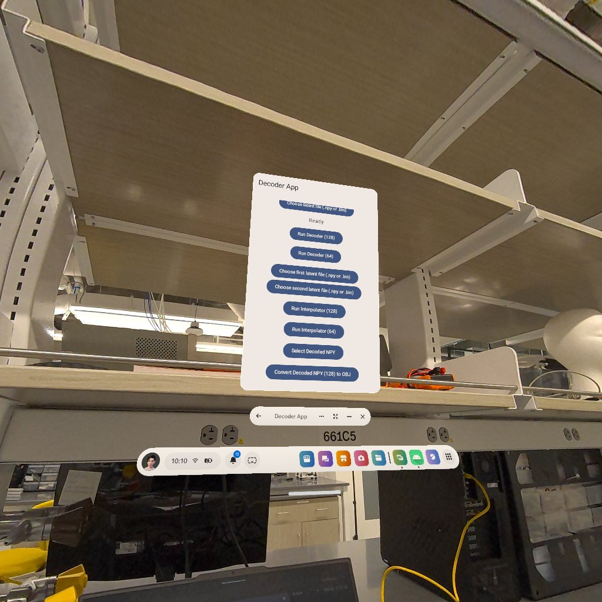

# AI-Powered Video Decompression for AR/VR Applications on Android

This repository is for academic coursework.
Do not copy or submit as your own assignment.

**Project Name:** AI-Powered Video Decompression for ARVR Applications on Android Devices

This Android application demonstrates a novel, AI-driven approach to volumetric video **decompression**, designed for real-time AR/VR applications. The project showcases an on-device pipeline that decodes compact neural representations (`.npy` files) into full 3D meshes (`.obj` files), ready for rendering on Android smartphones and standalone VR headsets like the Meta Quest 3.

By leveraging ONNX models for decoding and interpolation, this project provides a practical implementation of cutting-edge academic research in neural-3D-representation, proving its viability on resource-constrained mobile hardware.


---

## Core Features

- **On-Device AI Decompression**: Utilizes the ONNX Runtime for Android to decompress compact feature grids (e.g., 16KB or 32KB `.npy` files) into dense4D tensors, all directly on the device. The decoded `.npy` file is saved in `Downloads/DecoderAppResults/DecodedNPY128/` or `.../DecodedNPY64/` respectively.
- **AI-Powered Frame Interpolation**: Implements a neural interpolation model that can generate three intermediate frames between two given encoded frames, effectively quadrupling the frame rate of the volumetric video sequence. The interpolated frames are saved as new `.npy` files in the `Downloads/DecoderAppResults/InterpolationTest/` directory.
- **High-Fidelity Mesh Generation**: Employs the **Marching Cubes** algorithm, implemented in Java, to efficiently convert the decoder's dense tensor output into a standard 3D mesh.
- **Organized `.obj` Export**: Saves the generated 3D mesh as a standard `.obj` file to a structured subfolder within the device's public "Download" directory (`Downloads/DecoderAppResults/OBJ_.../`).
- **Platform Versatility**: The application is compatible with standard Android devices and has been verified to work on standalone VR headsets like the **Meta Quest 3** (by sideloading the APK).
- **Detailed Performance Benchmarking**: The UI provides a real-time, detailed breakdown of processing times for every critical stage of the pipeline.
- **Hybrid Language Stack**: Demonstrates a practical, hybrid programming approach, using **Kotlin** for the modern Android UI (Jetpack Compose) and app lifecycle management, while leveraging robust, high-performance **Java** for the core computational logic (ONNX model handling, Marching Cubes).

## Technology Stack

- **Primary Languages**: **[Kotlin](https://kotlinlang.org/)** (for UI and Android-specific code) , **[Java](https://www.java.com)** (for core algorithms and data processing) 
- **UI Toolkit**: [Jetpack Compose](https://developer.android.com/jetpack/compose)
- **Async Operations**: [Kotlin Coroutines](https://kotlinlang.org/docs/coroutines-overview.html)
- **ML Inference Engine**: [ONNX Runtime for Android](https://onnxruntime.ai/)


## How to Build and Run

1.  **Clone the Repository**
  - ```bash git clone https://github.com/jerry0012000/AI-Powered-ARVR-Video-Compression.git ```
  - 
2.  **Open in Android Studio**
  -   Open Android Studio (Hedgehog or newer is recommended).
  -   Select "Open" and navigate to the cloned repository folder.
  -   Wait for Gradle to sync all dependencies.

3.  **Place ONNX Models**
  -   The project expects the following ONNX model files to be placed in the `app/src/main/assets/` directory:
    - `decoder_feature_ae.onnx` (for the 128-channel decoder)
    - `decoder_feature64.onnx` (for the 64-channel decoder)
    - `transformer_compressed.onnx` (for the 128-channel frame interpolation model)
    - `transformer_compressed_64.onnx` (for the 64-channel frame interpolation model)

4.  **Build and Run**
  -   Connect an Android device (API 26+) or a Meta Quest 3 headset (with Developer Mode enabled).
  -   Click the "Run 'app'" button in Android Studio. The IDE will handle APK installation.

### Project Workflow & Structure

The application's UI is designed to give the user explicit, manual control over each stage of the content generation pipeline. The workflow is as follows:

1.  **Optional Frame Interpolation (Pre-Decompression Step):**
    *   The user first selects two compressed latent frames (`latent_A.npy` and `latent_B.npy`).
    *   They then run the Interpolator, which operates **on the compressed data itself** to generate three new latent frames between A and B, effectively quadrupling the frame count.

2.  **Decompression (Latent to Dense):**
    *   The user selects a single latent frame to process, either an original one or one generated from the interpolation step.
    *   Running the Decoder (64 or 128-channel) converts this compact `.npy` file into a high-resolution, dense feature grid, which is saved as a new, much larger "decoded" `.npy` file.

3.  **Mesh Generation (Dense to OBJ):**
    *   Finally, the user selects a "decoded" `.npy` file from the previous step.
    *   Running the "Convert to OBJ" function executes the Marching Cubes algorithm on the dense grid, generating the final, viewable 3D mesh and saving it as an `.obj` file.
